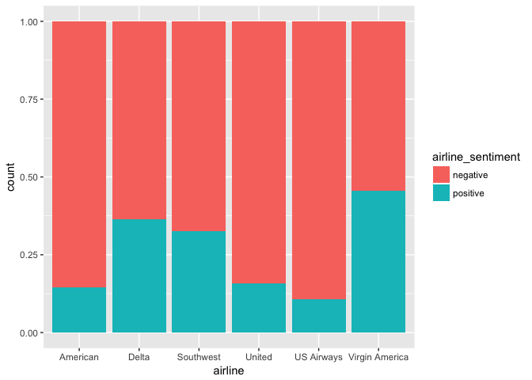

R Notebook
================

Load Library
============

``` r
library(readr)
library(tm)
```

    ## Warning: package 'tm' was built under R version 3.4.3

    ## Loading required package: NLP

``` r
library(SnowballC)
library(wordcloud)
```

    ## Loading required package: RColorBrewer

``` r
library(e1071)
library(gmodels)
library(ggplot2)
```

    ## 
    ## Attaching package: 'ggplot2'

    ## The following object is masked from 'package:NLP':
    ## 
    ##     annotate

``` r
library(caret)
```

    ## Warning: package 'caret' was built under R version 3.4.4

    ## Loading required package: lattice

    ## Warning in as.POSIXlt.POSIXct(Sys.time()): unknown timezone 'zone/tz/2018c.
    ## 1.0/zoneinfo/America/Los_Angeles'

``` r
library(ROCR)
```

    ## Loading required package: gplots

    ## 
    ## Attaching package: 'gplots'

    ## The following object is masked from 'package:wordcloud':
    ## 
    ##     textplot

    ## The following object is masked from 'package:stats':
    ## 
    ##     lowess

Step 1: Load the data
=====================

``` r
tweets <- read_csv("Tweets.csv")
```

    ## Parsed with column specification:
    ## cols(
    ##   tweet_id = col_double(),
    ##   airline_sentiment = col_character(),
    ##   airline_sentiment_confidence = col_double(),
    ##   negativereason = col_character(),
    ##   negativereason_confidence = col_double(),
    ##   airline = col_character(),
    ##   airline_sentiment_gold = col_character(),
    ##   name = col_character(),
    ##   negativereason_gold = col_character(),
    ##   retweet_count = col_integer(),
    ##   text = col_character(),
    ##   tweet_coord = col_character(),
    ##   tweet_created = col_character(),
    ##   tweet_location = col_character(),
    ##   user_timezone = col_character()
    ## )

``` r
head(tweets, n = 10)
```

    ## # A tibble: 10 x 15
    ##           tweet_id airline_sentime… airline_sentiment_conf… negativereason
    ##              <dbl> <chr>                              <dbl> <chr>         
    ##  1         5.70e¹⁷ neutral                            1.00  <NA>          
    ##  2         5.70e¹⁷ positive                           0.349 <NA>          
    ##  3         5.70e¹⁷ neutral                            0.684 <NA>          
    ##  4         5.70e¹⁷ negative                           1.00  Bad Flight    
    ##  5         5.70e¹⁷ negative                           1.00  Can't Tell    
    ##  6         5.70e¹⁷ negative                           1.00  Can't Tell    
    ##  7         5.70e¹⁷ positive                           0.674 <NA>          
    ##  8         5.70e¹⁷ neutral                            0.634 <NA>          
    ##  9         5.70e¹⁷ positive                           0.656 <NA>          
    ## 10         5.70e¹⁷ positive                           1.00  <NA>          
    ## # ... with 11 more variables: negativereason_confidence <dbl>,
    ## #   airline <chr>, airline_sentiment_gold <chr>, name <chr>,
    ## #   negativereason_gold <chr>, retweet_count <int>, text <chr>,
    ## #   tweet_coord <chr>, tweet_created <chr>, tweet_location <chr>,
    ## #   user_timezone <chr>

Binary Classification (Filter out nuetral sentiment)
====================================================

``` r
tweets <- subset(tweets, airline_sentiment %in% c("positive", "negative"))
table(tweets$airline_sentiment)
```

    ## 
    ## negative positive 
    ##     9178     2363

#### Check proportions of negative and positive

``` r
#convert to factor before using table
tweets$airline_sentiment <- as.factor(tweets$airline_sentiment)
tweets$airline <- as.factor(tweets$airline)

table(tweets$airline_sentiment)
```

    ## 
    ## negative positive 
    ##     9178     2363

``` r
table(tweets$airline)
```

    ## 
    ##       American          Delta      Southwest         United     US Airways 
    ##           2296           1499           1756           3125           2532 
    ## Virgin America 
    ##            333

``` r
#Plot proportion table of airlines with their airline sentiment
ggplot(tweets, aes(x = airline, fill = airline_sentiment)) + geom_bar(position = "fill")
```

 \# \# \#\#\#\#Begin preparing the text data

``` r
#Get rid of special characters
tweets$text <- gsub("[^[:alnum:][:blank:]?&/\\-]", "", tweets$text)

#Looks at tweets 
tweets$text[1:5]
```

    ## [1] "VirginAmerica plus youve added commercials to the experience tacky"                                                               
    ## [2] "VirginAmerica its really aggressive to blast obnoxious entertainment in your guests faces &amp they have little recourse"         
    ## [3] "VirginAmerica and its a really big bad thing about it"                                                                            
    ## [4] "VirginAmerica seriously would pay 30 a flight for seats that didnt have this playingits really the only bad thing about flying VA"
    ## [5] "VirginAmerica yes nearly every time I fly VX this ear worm wont go away "

``` r
#remove @airline name as it is not neccessary
stopwords = c("American", "Delta", "Southwest", "United", "US Airways", "VirginAmerica", "SouthwestAirlines", "AmericanAirlines" )
tweets$text <- removeWords(tweets$text,stopwords)

#check to make sure words were removed 
tweets$text[1:10]
```

    ##  [1] " plus youve added commercials to the experience tacky"                                                                  
    ##  [2] " its really aggressive to blast obnoxious entertainment in your guests faces &amp they have little recourse"            
    ##  [3] " and its a really big bad thing about it"                                                                               
    ##  [4] " seriously would pay 30 a flight for seats that didnt have this playingits really the only bad thing about flying VA"   
    ##  [5] " yes nearly every time I fly VX this ear worm wont go away "                                                            
    ##  [6] "virginamerica Well I didntbut NOW I DO -D"                                                                              
    ##  [7] " it was amazing and arrived an hour early Youre too good to me"                                                         
    ##  [8] " I &lt3 pretty graphics so much better than minimal iconography D"                                                      
    ##  [9] " This is such a great deal Already thinking about my 2nd trip to Australia &amp I havent even gone on my 1st trip yet p"
    ## [10] " virginmedia Im flying your fabulous Seductive skies again U take all the stress away from travel http//tco/ahlXHhKiyn"

``` r
#create corpus and examine it 
tweet_corpus <- VCorpus(VectorSource(tweets$text))

lapply(tweet_corpus[1:5], as.character)
```

    ## $`1`
    ## [1] " plus youve added commercials to the experience tacky"
    ## 
    ## $`2`
    ## [1] " its really aggressive to blast obnoxious entertainment in your guests faces &amp they have little recourse"
    ## 
    ## $`3`
    ## [1] " and its a really big bad thing about it"
    ## 
    ## $`4`
    ## [1] " seriously would pay 30 a flight for seats that didnt have this playingits really the only bad thing about flying VA"
    ## 
    ## $`5`
    ## [1] " yes nearly every time I fly VX this ear worm wont go away "

#### Clean up Corpus

``` r
#Convert text to lowercase 
tweet_corpus_clean <- tm_map(tweet_corpus, content_transformer(tolower))

#remove numbres, stopwords, and punctuation
tweet_corpus_clean <- tm_map(tweet_corpus_clean, removeNumbers)
tweet_corpus_clean <- tm_map(tweet_corpus_clean, removeWords, stopwords('english'))
tweet_corpus_clean <- tm_map(tweet_corpus_clean, removePunctuation)

#Check to see if clean
lapply(tweet_corpus_clean[1:5], as.character)
```

    ## $`1`
    ## [1] " plus youve added commercials   experience tacky"
    ## 
    ## $`2`
    ## [1] "  really aggressive  blast obnoxious entertainment   guests faces amp   little recourse"
    ## 
    ## $`3`
    ## [1] "    really big bad thing  "
    ## 
    ## $`4`
    ## [1] " seriously  pay   flight  seats  didnt   playingits really   bad thing  flying va"
    ## 
    ## $`5`
    ## [1] " yes nearly every time  fly vx  ear worm wont go away "

#### Wordstem and check final clean corpus

``` r
#wordstem and strip whitespace 
tweet_corpus_clean <- tm_map(tweet_corpus_clean, stemDocument)
tweet_corpus_clean <- tm_map(tweet_corpus_clean, stripWhitespace)

#remove other common words that dont help with sentiment
stopwords2 <- c("southwestair", "americanair", "jetblu", "usairway", "unit", "will", "newark", "houston", "airport", "plane", "airlin", "travel", "gate", "just", "lax", "can", "ive", "flightl", "jfk", "what", "let", "want", "flightr", "your", "miss", "that", "follow", "one", "made", "flt", "fli", "even", "use", "week", "two", "anoth", "see", "make", "got", "said", "tonight", "website", "tomorrow", "put", "year", "dfw", "system", "guy", "night", "show", "today", "get", "yet", "number", "told", "think", "websit", "day", "also", "agent", "pilot", "point", "onlin", "email", "amp", "keep", "morn", "fleet", "min", "someon", "flight")
tweet_corpus_clean <- tm_map(tweet_corpus_clean, removeWords, stopwords2)

#create dataframe
tweet_dtm <- DocumentTermMatrix(tweet_corpus_clean)

#Check final text 
lapply(tweet_corpus_clean[1:5], as.character)
```

    ## $`1`
    ## [1] "plus youv ad commerci experi tacki"
    ## 
    ## $`2`
    ## [1] "realli aggress blast obnoxi entertain guest face  littl recours"
    ## 
    ## $`3`
    ## [1] "realli big bad thing"
    ## 
    ## $`4`
    ## [1] "serious pay  seat didnt playingit realli bad thing  va"
    ## 
    ## $`5`
    ## [1] "yes near everi time  vx ear worm wont go away"

``` r
tweet_dtm
```

    ## <<DocumentTermMatrix (documents: 11541, terms: 9353)>>
    ## Non-/sparse entries: 82749/107860224
    ## Sparsity           : 100%
    ## Maximal term length: 46
    ## Weighting          : term frequency (tf)

#### Create training and test dataframe and lables

``` r
#create random sample
set.seed(123)
rand_sam <- sample(11541, 10541)

#training and test 
tweet_dtm_train <- tweet_dtm[rand_sam, ]
tweet_dtm_test <- tweet_dtm[-rand_sam, ]

#labels 
tweet_train_labels <- tweets[rand_sam, ]$airline_sentiment
tweet_test_labels <- tweets[-rand_sam, ]$airline_sentiment

#check that proportions are similar
prop.table(table(tweet_train_labels))
```

    ## tweet_train_labels
    ##  negative  positive 
    ## 0.7952756 0.2047244

``` r
prop.table(table(tweet_test_labels))
```

    ## tweet_test_labels
    ## negative positive 
    ##    0.795    0.205

#### Word Cloud visualization

``` r
wordcloud(tweet_corpus_clean,  max.words = 150, min.freq = 10, random.order = F)
```

 \# \# \#\#\#\#Subset the data to visualize common words for each sentiment

``` r
positive <- subset(tweets, airline_sentiment== "positive")
negative <- subset(tweets, airline_sentiment== "negative")
```

``` r
wordcloud(positive$text, max.words = 100, scale = c(3, .5))
```


``` r
wordcloud(negative$text, max.words = 100, scale = c(3, .5))
```

 \# \# \#Step 3: Training a model on the data

``` r
tweet_dtm_freq_train <- removeSparseTerms(tweet_dtm_train, 0.999)
tweet_dtm_freq_train
```

    ## <<DocumentTermMatrix (documents: 10541, terms: 1022)>>
    ## Non-/sparse entries: 60766/10712136
    ## Sparsity           : 99%
    ## Maximal term length: 17
    ## Weighting          : term frequency (tf)

``` r
tweet_freq_words <- findFreqTerms(tweet_dtm_train, 10)
str(tweet_freq_words)
```

    ##  chr [1:1106] "abl" "absolut" "absurd" "accept" "access" "accommod" ...

#### Create DTMs with only the frequent terms

``` r
tweet_dtm_freq_train <- tweet_dtm_train[ , tweet_freq_words]
tweet_dtm_freq_test <- tweet_dtm_test[ , tweet_freq_words]
```

#### Create a function to convert counts to a factor and apply it to columns of train/test data and begin training a model on the data

``` r
convert_counts <- function(x) {
  x <- ifelse(x > 0, "Yes", "No")
}

tweet_train <- apply(tweet_dtm_freq_train, MARGIN = 2, convert_counts)
tweet_test <- apply(tweet_dtm_freq_test, MARGIN = 2, convert_counts)

tweet_classifier <- naiveBayes(tweet_train, tweet_train_labels)
```

Step 4: Evaluate the model's performance
========================================

``` r
tweet_test_pred <- predict(tweet_classifier, tweet_test)

head(tweet_test_pred, n = 15)
```

    ##  [1] positive negative negative negative positive negative positive
    ##  [8] negative negative negative positive positive negative positive
    ## [15] positive
    ## Levels: negative positive

``` r
conf<- confusionMatrix(tweet_test_pred, tweet_test_labels)
conf
```

    ## Confusion Matrix and Statistics
    ## 
    ##           Reference
    ## Prediction negative positive
    ##   negative      742       47
    ##   positive       53      158
    ##                                           
    ##                Accuracy : 0.9             
    ##                  95% CI : (0.8797, 0.9179)
    ##     No Information Rate : 0.795           
    ##     P-Value [Acc > NIR] : <2e-16          
    ##                                           
    ##                   Kappa : 0.6965          
    ##  Mcnemar's Test P-Value : 0.6171          
    ##                                           
    ##             Sensitivity : 0.9333          
    ##             Specificity : 0.7707          
    ##          Pos Pred Value : 0.9404          
    ##          Neg Pred Value : 0.7488          
    ##              Prevalence : 0.7950          
    ##          Detection Rate : 0.7420          
    ##    Detection Prevalence : 0.7890          
    ##       Balanced Accuracy : 0.8520          
    ##                                           
    ##        'Positive' Class : negative        
    ## 

``` r
confusion_matrix <- as.data.frame(table(tweet_test_pred, tweet_test_labels))

ggplot(data = confusion_matrix,      aes(x = tweet_test_pred, y = tweet_test_labels)) +
  geom_tile(aes(fill = Freq)) +
  geom_text(aes(label = sprintf("%1.0f", Freq)), vjust = 1) +
  scale_fill_gradient(low = "#ff7f50",
                      high = "#003767",
                      trans = "log")
```

 \#\#\#\#90% classified accurately \# \# \#Step 5: Improve the model

``` r
tweet_classifier2 <- naiveBayes(tweet_train, tweet_train_labels, laplace = 1)
tweet_test_pred2 <- predict(tweet_classifier2, tweet_test)

conf2<- confusionMatrix(tweet_test_pred2, tweet_test_labels)
conf2
```

    ## Confusion Matrix and Statistics
    ## 
    ##           Reference
    ## Prediction negative positive
    ##   negative      756       49
    ##   positive       39      156
    ##                                           
    ##                Accuracy : 0.912           
    ##                  95% CI : (0.8927, 0.9288)
    ##     No Information Rate : 0.795           
    ##     P-Value [Acc > NIR] : <2e-16          
    ##                                           
    ##                   Kappa : 0.725           
    ##  Mcnemar's Test P-Value : 0.3374          
    ##                                           
    ##             Sensitivity : 0.9509          
    ##             Specificity : 0.7610          
    ##          Pos Pred Value : 0.9391          
    ##          Neg Pred Value : 0.8000          
    ##              Prevalence : 0.7950          
    ##          Detection Rate : 0.7560          
    ##    Detection Prevalence : 0.8050          
    ##       Balanced Accuracy : 0.8560          
    ##                                           
    ##        'Positive' Class : negative        
    ## 

``` r
confusion_matrix <- as.data.frame(table(tweet_test_pred2, tweet_test_labels))

ggplot(data = confusion_matrix,      aes(x = tweet_test_pred2, y = tweet_test_labels)) +
  geom_tile(aes(fill = Freq)) +
  geom_text(aes(label = sprintf("%1.0f", Freq)), vjust = 1) +
  scale_fill_gradient(low = "#ff7f50",
                      high = "#003767",
                      trans = "log")
```

 \#\#\#\#91.2% classified accurately
