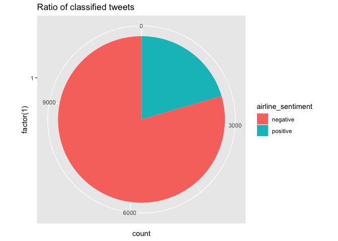
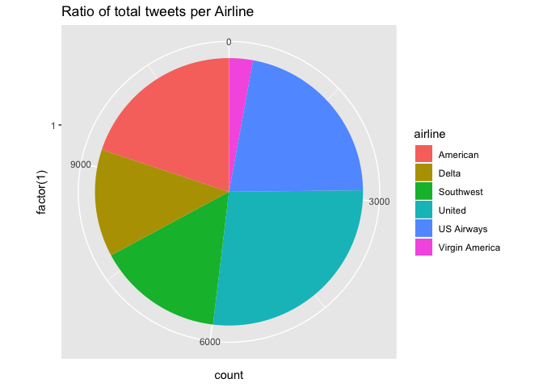
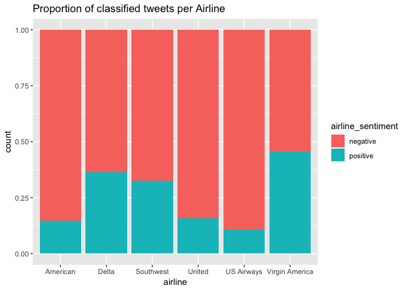
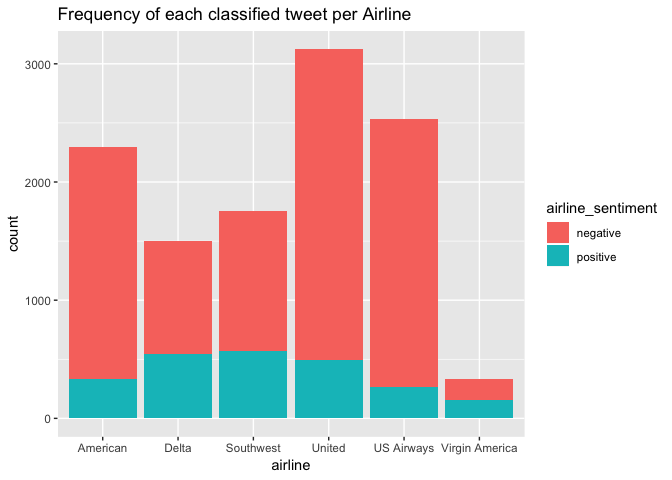

R Notebook
================

Load Library
============

``` r
library(readr)
library(tm)
```

    ## Warning: package 'tm' was built under R version 3.4.3

    ## Loading required package: NLP

``` r
library(SnowballC)
library(wordcloud)
```

    ## Loading required package: RColorBrewer

``` r
library(e1071)
library(gmodels)
library(ggplot2)
```

    ## 
    ## Attaching package: 'ggplot2'

    ## The following object is masked from 'package:NLP':
    ## 
    ##     annotate

``` r
library(caret)
```

    ## Warning: package 'caret' was built under R version 3.4.4

    ## Loading required package: lattice

    ## Warning in as.POSIXlt.POSIXct(Sys.time()): unknown timezone 'zone/tz/2018c.
    ## 1.0/zoneinfo/America/Los_Angeles'

``` r
library(ROCR)
```

    ## Loading required package: gplots

    ## 
    ## Attaching package: 'gplots'

    ## The following object is masked from 'package:wordcloud':
    ## 
    ##     textplot

    ## The following object is masked from 'package:stats':
    ## 
    ##     lowess

``` r
library(dplyr)
```

    ## 
    ## Attaching package: 'dplyr'

    ## The following objects are masked from 'package:stats':
    ## 
    ##     filter, lag

    ## The following objects are masked from 'package:base':
    ## 
    ##     intersect, setdiff, setequal, union

Step 1: Load the data
=====================

``` r
tweets <- read_csv("Tweets.csv")
```

    ## Parsed with column specification:
    ## cols(
    ##   tweet_id = col_double(),
    ##   airline_sentiment = col_character(),
    ##   airline_sentiment_confidence = col_double(),
    ##   negativereason = col_character(),
    ##   negativereason_confidence = col_double(),
    ##   airline = col_character(),
    ##   airline_sentiment_gold = col_character(),
    ##   name = col_character(),
    ##   negativereason_gold = col_character(),
    ##   retweet_count = col_integer(),
    ##   text = col_character(),
    ##   tweet_coord = col_character(),
    ##   tweet_created = col_character(),
    ##   tweet_location = col_character(),
    ##   user_timezone = col_character()
    ## )

``` r
tweets %>% head(10)
```

    ## # A tibble: 10 x 15
    ##           tweet_id airline_sentime… airline_sentiment_conf… negativereason
    ##              <dbl> <chr>                              <dbl> <chr>         
    ##  1         5.70e¹⁷ neutral                            1.00  <NA>          
    ##  2         5.70e¹⁷ positive                           0.349 <NA>          
    ##  3         5.70e¹⁷ neutral                            0.684 <NA>          
    ##  4         5.70e¹⁷ negative                           1.00  Bad Flight    
    ##  5         5.70e¹⁷ negative                           1.00  Can't Tell    
    ##  6         5.70e¹⁷ negative                           1.00  Can't Tell    
    ##  7         5.70e¹⁷ positive                           0.674 <NA>          
    ##  8         5.70e¹⁷ neutral                            0.634 <NA>          
    ##  9         5.70e¹⁷ positive                           0.656 <NA>          
    ## 10         5.70e¹⁷ positive                           1.00  <NA>          
    ## # ... with 11 more variables: negativereason_confidence <dbl>,
    ## #   airline <chr>, airline_sentiment_gold <chr>, name <chr>,
    ## #   negativereason_gold <chr>, retweet_count <int>, text <chr>,
    ## #   tweet_coord <chr>, tweet_created <chr>, tweet_location <chr>,
    ## #   user_timezone <chr>

Binary Classification (Filter out nuetral sentiment)
====================================================

``` r
tweets %>% subset(airline_sentiment %in% c("positive", "negative")) -> tweets
tweets$airline_sentiment %>% table()
```

    ## .
    ## negative positive 
    ##     9178     2363

#### Check proportions of negative and positive

``` r
#convert to factor before using table
tweets$airline_sentiment %>% as.factor() -> tweets$airline_sentiment
tweets$airline %>% as.factor() -> tweets$airline

#sum of each category of tweet
tweets$airline_sentiment %>% table()
```

    ## .
    ## negative positive 
    ##     9178     2363

``` r
#sum of total tweets each airline has
tweets$airline %>% table()
```

    ## .
    ##       American          Delta      Southwest         United     US Airways 
    ##           2296           1499           1756           3125           2532 
    ## Virgin America 
    ##            333

``` r
#Pie chart comparing the ratio of negative and positive tweets
tweets %>% ggplot(aes(x= factor(1), fill= airline_sentiment)) + 
  geom_bar(width = 1) + coord_polar(theta="y") + 
  ggtitle("Ratio of classified tweets")
```



``` r
#Pie chart comparing the ratio of tweets per airline
tweets %>% ggplot(aes(x= factor(1), fill= airline)) + 
  geom_bar(width = 1) + coord_polar(theta="y") + 
  ggtitle("Ratio of total tweets per Airline")
```



``` r
#Plot proportion table of airlines with their airline sentiment
tweets %>% ggplot(aes(x = airline, fill = airline_sentiment)) + 
  geom_bar(position = "fill") + 
  ggtitle("Proportion of classified tweets per Airline")
```



``` r
#Plot the frequency of the three different types of tweets each airline receives
tweets %>% ggplot(aes(x = airline, fill = airline_sentiment)) + 
  geom_bar() + 
  ggtitle("Frequency of each classified tweet per Airline")
```

 \# \# \#\#\#\#Begin preparing the text data

``` r
#Get rid of special characters
tweets$text <- gsub("[^[:alnum:][:blank:]?&/\\-]", "", tweets$text)

#Looks at tweets 
tweets$text[1:5]
```

    ## [1] "VirginAmerica plus youve added commercials to the experience tacky"                                                               
    ## [2] "VirginAmerica its really aggressive to blast obnoxious entertainment in your guests faces &amp they have little recourse"         
    ## [3] "VirginAmerica and its a really big bad thing about it"                                                                            
    ## [4] "VirginAmerica seriously would pay 30 a flight for seats that didnt have this playingits really the only bad thing about flying VA"
    ## [5] "VirginAmerica yes nearly every time I fly VX this ear worm wont go away "

``` r
#remove @airline name as it is not neccessary
stopwords = c("American", "Delta", "Southwest", "United", "US Airways", "VirginAmerica", "SouthwestAirlines", "AmericanAirlines" )
tweets$text %>% removeWords(stopwords) -> tweets$text

#check to make sure words were removed 
tweets$text[1:5]
```

    ## [1] " plus youve added commercials to the experience tacky"                                                               
    ## [2] " its really aggressive to blast obnoxious entertainment in your guests faces &amp they have little recourse"         
    ## [3] " and its a really big bad thing about it"                                                                            
    ## [4] " seriously would pay 30 a flight for seats that didnt have this playingits really the only bad thing about flying VA"
    ## [5] " yes nearly every time I fly VX this ear worm wont go away "

``` r
#create corpus and examine it 
tweets$text %>% VectorSource() %>% VCorpus() -> tweet_corpus

tweet_corpus[1:5] %>% lapply(as.character)
```

    ## $`1`
    ## [1] " plus youve added commercials to the experience tacky"
    ## 
    ## $`2`
    ## [1] " its really aggressive to blast obnoxious entertainment in your guests faces &amp they have little recourse"
    ## 
    ## $`3`
    ## [1] " and its a really big bad thing about it"
    ## 
    ## $`4`
    ## [1] " seriously would pay 30 a flight for seats that didnt have this playingits really the only bad thing about flying VA"
    ## 
    ## $`5`
    ## [1] " yes nearly every time I fly VX this ear worm wont go away "

#### Clean up Corpus

``` r
#Convert text to lowercase, remove numbers, stopwords, and punctuation 
tweet_corpus %>% tm_map(content_transformer(tolower)) %>% 
  tm_map(removeNumbers) %>% 
  tm_map(removeWords, stopwords('english')) %>% 
  tm_map(removePunctuation) -> tweet_corpus_clean

#Check to see if clean
lapply(tweet_corpus_clean[1:5], as.character)
```

    ## $`1`
    ## [1] " plus youve added commercials   experience tacky"
    ## 
    ## $`2`
    ## [1] "  really aggressive  blast obnoxious entertainment   guests faces amp   little recourse"
    ## 
    ## $`3`
    ## [1] "    really big bad thing  "
    ## 
    ## $`4`
    ## [1] " seriously  pay   flight  seats  didnt   playingits really   bad thing  flying va"
    ## 
    ## $`5`
    ## [1] " yes nearly every time  fly vx  ear worm wont go away "

#### Wordstem and check final clean corpus

``` r
#wordstem and strip whitespace 
tweet_corpus_clean %>%  tm_map(stemDocument) %>% 
  tm_map(stripWhitespace) -> tweet_corpus_clean
  
#remove other common words that dont help with sentiment
stopwords2 <- c("southwestair", "americanair", "jetblu", "usairway", "unit", "newark", "houston", "airport", "lax", "jfk", "what", "your", "that", "one", "week", "two", "tonight", "tomorrow", "year", "dfw", "night")
tweet_corpus_clean %>% tm_map(removeWords, stopwords2) -> tweet_corpus_clean

#create dataframe
tweet_corpus_clean %>% DocumentTermMatrix() -> tweet_dtm

#Check final text 
tweet_corpus_clean[1:5] %>% lapply(as.character)
```

    ## $`1`
    ## [1] "plus youv ad commerci experi tacki"
    ## 
    ## $`2`
    ## [1] "realli aggress blast obnoxi entertain guest face amp littl recours"
    ## 
    ## $`3`
    ## [1] "realli big bad thing"
    ## 
    ## $`4`
    ## [1] "serious pay flight seat didnt playingit realli bad thing fli va"
    ## 
    ## $`5`
    ## [1] "yes near everi time fli vx ear worm wont go away"

``` r
tweet_dtm
```

    ## <<DocumentTermMatrix (documents: 11541, terms: 9402)>>
    ## Non-/sparse entries: 100468/108408014
    ## Sparsity           : 100%
    ## Maximal term length: 46
    ## Weighting          : term frequency (tf)

#### Create training and test dataframe and lables

``` r
#create random sample
set.seed(123)
idx <- sample(seq(1, 3), size = nrow(tweet_dtm), replace = TRUE, prob = c(.8, .2, .2 ))

#training, test, and validation
tweet_dtm_train <- tweet_dtm[idx == 1, ]
tweet_dtm_test <- tweet_dtm[idx == 2,]
tweet_dtm_validation <- tweet_dtm[idx == 3,]

#labels 
tweet_train_labels <- tweets[idx == 1, ]$airline_sentiment
tweet_test_labels <- tweets[idx == 2, ]$airline_sentiment
tweet_validation_labels <- tweets[idx == 3, ]$airline_sentiment

#check that proportions are similar
tweet_train_labels %>% table() %>% prop.table()
```

    ## .
    ##  negative  positive 
    ## 0.7905834 0.2094166

``` r
tweet_test_labels %>% table() %>% prop.table()
```

    ## .
    ##  negative  positive 
    ## 0.8102619 0.1897381

``` r
tweet_validation_labels %>% table() %>% prop.table()
```

    ## .
    ##  negative  positive 
    ## 0.7993811 0.2006189

#### Word Cloud visualization

``` r
tweet_corpus_clean %>% wordcloud(max.words = 150, min.freq = 10, random.order = F)
```

 \# \# \#\#\#\#Subset the data to visualize common words for each sentiment

``` r
tweets %>% subset(airline_sentiment== "positive") -> positive
tweets %>% subset(airline_sentiment== "negative") -> negative
```

``` r
positive$text %>% wordcloud(max.words = 100, scale = c(3, .5))
```


``` r
negative$text %>% wordcloud(max.words = 100, scale = c(3, .5))
```

 \# \# \#Step 3: Training a model on the data

``` r
tweet_dtm_train %>% removeSparseTerms(0.999) -> tweet_dtm_freq_train
tweet_dtm_freq_train

tweet_dtm_train %>% findFreqTerms(10) -> tweet_freq_words
str(tweet_freq_words)
```

#### Create DTMs with only the frequent terms

``` r
tweet_dtm_freq_train <- tweet_dtm_train[ , tweet_freq_words]
tweet_dtm_freq_validation <- tweet_dtm_validation[ , tweet_freq_words]
tweet_dtm_freq_test <- tweet_dtm_test[ , tweet_freq_words]
```

#### Create a function to convert counts to a factor and apply it to columns of train/test data and begin training a model on the data

``` r
convert_counts <- function(x) {
  x <- ifelse(x > 0, "Yes", "No")
}

tweet_dtm_freq_train %>% apply(MARGIN = 2, convert_counts) -> tweet_train
tweet_dtm_freq_validation %>% apply(MARGIN = 2, convert_counts) -> tweet_validation 
tweet_dtm_freq_test %>% apply(MARGIN = 2, convert_counts) -> tweet_test

tweet_train %>% naiveBayes(tweet_train_labels) -> tweet_classifier
```

Step 4: Evaluate the model's performance
========================================

``` r
tweet_classifier %>% predict(tweet_validation) -> tweet_validation_pred

tweet_validation_pred %>% head(n = 15)
```

    ##  [1] negative positive negative negative positive positive negative
    ##  [8] negative positive negative negative negative positive positive
    ## [15] negative
    ## Levels: negative positive

``` r
tweet_validation_pred %>% confusionMatrix(tweet_validation_labels) -> conf

conf
```

    ## Confusion Matrix and Statistics
    ## 
    ##           Reference
    ## Prediction negative positive
    ##   negative     1439      100
    ##   positive      111      289
    ##                                           
    ##                Accuracy : 0.8912          
    ##                  95% CI : (0.8765, 0.9047)
    ##     No Information Rate : 0.7994          
    ##     P-Value [Acc > NIR] : <2e-16          
    ##                                           
    ##                   Kappa : 0.6643          
    ##  Mcnemar's Test P-Value : 0.4912          
    ##                                           
    ##             Sensitivity : 0.9284          
    ##             Specificity : 0.7429          
    ##          Pos Pred Value : 0.9350          
    ##          Neg Pred Value : 0.7225          
    ##              Prevalence : 0.7994          
    ##          Detection Rate : 0.7421          
    ##    Detection Prevalence : 0.7937          
    ##       Balanced Accuracy : 0.8357          
    ##                                           
    ##        'Positive' Class : negative        
    ## 

``` r
confusion_matrix <- as.data.frame(table(tweet_validation_pred, tweet_validation_labels))

confusion_matrix %>% ggplot(aes(x = tweet_validation_pred, y = tweet_validation_labels)) + 
  geom_tile(aes(fill = Freq)) +
  geom_text(aes(label = sprintf("%1.0f", Freq)), vjust = 1) +
  scale_fill_gradient(low = "#ff7f50",
                      high = "#003767",
                      trans = "log")
```

 \#\#\#\#89.12% classified accurately \# \# \#Step 5: Improve the model

``` r
tweet_train %>% naiveBayes(tweet_train_labels, laplace = 1) -> tweet_classifier2

tweet_classifier2 %>% predict(tweet_validation) -> tweet_validation_pred2

tweet_validation_pred2 %>% confusionMatrix(tweet_validation_labels) -> conf2

conf2
```

    ## Confusion Matrix and Statistics
    ## 
    ##           Reference
    ## Prediction negative positive
    ##   negative     1446       94
    ##   positive      104      295
    ##                                          
    ##                Accuracy : 0.8979         
    ##                  95% CI : (0.8835, 0.911)
    ##     No Information Rate : 0.7994         
    ##     P-Value [Acc > NIR] : <2e-16         
    ##                                          
    ##                   Kappa : 0.6847         
    ##  Mcnemar's Test P-Value : 0.5224         
    ##                                          
    ##             Sensitivity : 0.9329         
    ##             Specificity : 0.7584         
    ##          Pos Pred Value : 0.9390         
    ##          Neg Pred Value : 0.7393         
    ##              Prevalence : 0.7994         
    ##          Detection Rate : 0.7457         
    ##    Detection Prevalence : 0.7942         
    ##       Balanced Accuracy : 0.8456         
    ##                                          
    ##        'Positive' Class : negative       
    ## 

``` r
confusion_matrix2 <- as.data.frame(table(tweet_validation_pred2, tweet_validation_labels))

confusion_matrix2 %>% ggplot(aes(x = tweet_validation_pred2, y = tweet_validation_labels)) +
  geom_tile(aes(fill = Freq)) +
  geom_text(aes(label = sprintf("%1.0f", Freq)), vjust = 1) +
  scale_fill_gradient(low = "#ff7f50",
                      high = "#003767",
                      trans = "log")
```

 \#\#\#\#89.79% classified accurately \# \#Final Test on test dataset

``` r
tweet_classifier2 %>% predict(tweet_test) -> tweet_test_pred

tweet_test_pred %>% confusionMatrix(tweet_test_labels) -> conf3

conf3
```

    ## Confusion Matrix and Statistics
    ## 
    ##           Reference
    ## Prediction negative positive
    ##   negative     1430       71
    ##   positive       86      284
    ##                                           
    ##                Accuracy : 0.9161          
    ##                  95% CI : (0.9026, 0.9283)
    ##     No Information Rate : 0.8103          
    ##     P-Value [Acc > NIR] : <2e-16          
    ##                                           
    ##                   Kappa : 0.7314          
    ##  Mcnemar's Test P-Value : 0.2639          
    ##                                           
    ##             Sensitivity : 0.9433          
    ##             Specificity : 0.8000          
    ##          Pos Pred Value : 0.9527          
    ##          Neg Pred Value : 0.7676          
    ##              Prevalence : 0.8103          
    ##          Detection Rate : 0.7643          
    ##    Detection Prevalence : 0.8022          
    ##       Balanced Accuracy : 0.8716          
    ##                                           
    ##        'Positive' Class : negative        
    ## 

``` r
confusion_matrix3 <- as.data.frame(table(tweet_test_pred, tweet_test_labels))

confusion_matrix3 %>% ggplot(aes(x = tweet_test_pred, y = tweet_test_labels)) +
  geom_tile(aes(fill = Freq)) +
  geom_text(aes(label = sprintf("%1.0f", Freq)), vjust = 1) +
  scale_fill_gradient(low = "#ff7f50",
                      high = "#003767",
                      trans = "log")
```

 \#\#\#\#91.61% classified correctly
