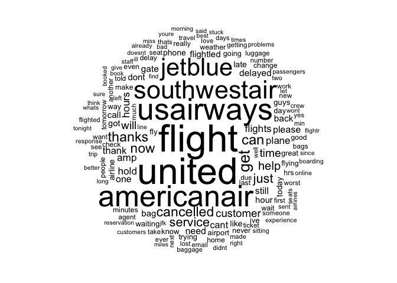
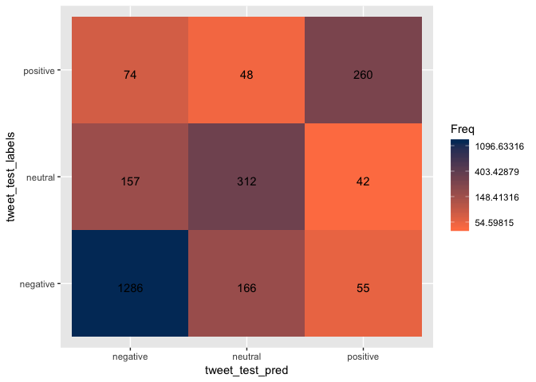

Positive/Negative/Neutral Naive Bayes Classification
================

Load Library
============

``` r
library(readr)
library(tm)
library(SnowballC)
library(wordcloud)
library(e1071)
library(gmodels)
library(ggplot2)
library(caret)
library(ROCR)
library(dplyr)
```

Step 1: Load the data
=====================

``` r
tweets <- read_csv("Tweets.csv")
tweets %>% head(n = 10)
```

    ## # A tibble: 10 x 15
    ##    tweet_id airline_sentime… airline_sentime… negativereason
    ##       <dbl> <chr>                       <dbl> <chr>         
    ##  1  5.70e17 neutral                     1     <NA>          
    ##  2  5.70e17 positive                    0.349 <NA>          
    ##  3  5.70e17 neutral                     0.684 <NA>          
    ##  4  5.70e17 negative                    1     Bad Flight    
    ##  5  5.70e17 negative                    1     Can't Tell    
    ##  6  5.70e17 negative                    1     Can't Tell    
    ##  7  5.70e17 positive                    0.674 <NA>          
    ##  8  5.70e17 neutral                     0.634 <NA>          
    ##  9  5.70e17 positive                    0.656 <NA>          
    ## 10  5.70e17 positive                    1     <NA>          
    ## # ... with 11 more variables: negativereason_confidence <dbl>,
    ## #   airline <chr>, airline_sentiment_gold <lgl>, name <chr>,
    ## #   negativereason_gold <lgl>, retweet_count <dbl>, text <chr>,
    ## #   tweet_coord <chr>, tweet_created <chr>, tweet_location <chr>,
    ## #   user_timezone <chr>

Step 2: Explore the data
========================

``` r
str(tweets)
```

    ## Classes 'tbl_df', 'tbl' and 'data.frame':    14640 obs. of  15 variables:
    ##  $ tweet_id                    : num  5.7e+17 5.7e+17 5.7e+17 5.7e+17 5.7e+17 ...
    ##  $ airline_sentiment           : chr  "neutral" "positive" "neutral" "negative" ...
    ##  $ airline_sentiment_confidence: num  1 0.349 0.684 1 1 ...
    ##  $ negativereason              : chr  NA NA NA "Bad Flight" ...
    ##  $ negativereason_confidence   : num  NA 0 NA 0.703 1 ...
    ##  $ airline                     : chr  "Virgin America" "Virgin America" "Virgin America" "Virgin America" ...
    ##  $ airline_sentiment_gold      : logi  NA NA NA NA NA NA ...
    ##  $ name                        : chr  "cairdin" "jnardino" "yvonnalynn" "jnardino" ...
    ##  $ negativereason_gold         : logi  NA NA NA NA NA NA ...
    ##  $ retweet_count               : num  0 0 0 0 0 0 0 0 0 0 ...
    ##  $ text                        : chr  "@VirginAmerica What @dhepburn said." "@VirginAmerica plus you've added commercials to the experience... tacky." "@VirginAmerica I didn't today... Must mean I need to take another trip!" "@VirginAmerica it's really aggressive to blast obnoxious \"entertainment\" in your guests' faces &amp; they hav"| __truncated__ ...
    ##  $ tweet_coord                 : chr  NA NA NA NA ...
    ##  $ tweet_created               : chr  "2015-02-24 11:35:52 -0800" "2015-02-24 11:15:59 -0800" "2015-02-24 11:15:48 -0800" "2015-02-24 11:15:36 -0800" ...
    ##  $ tweet_location              : chr  NA NA "Lets Play" NA ...
    ##  $ user_timezone               : chr  "Eastern Time (US & Canada)" "Pacific Time (US & Canada)" "Central Time (US & Canada)" "Pacific Time (US & Canada)" ...
    ##  - attr(*, "problems")=Classes 'tbl_df', 'tbl' and 'data.frame': 72 obs. of  5 variables:
    ##   ..$ row     : int  1287 1287 2018 2018 2136 2202 2202 2384 2384 3006 ...
    ##   ..$ col     : chr  "airline_sentiment_gold" "negativereason_gold" "airline_sentiment_gold" "negativereason_gold" ...
    ##   ..$ expected: chr  "1/0/T/F/TRUE/FALSE" "1/0/T/F/TRUE/FALSE" "1/0/T/F/TRUE/FALSE" "1/0/T/F/TRUE/FALSE" ...
    ##   ..$ actual  : chr  "negative" "Late Flight\nFlight Attendant Complaints" "negative" "Late Flight\nLost Luggage" ...
    ##   ..$ file    : chr  "'Tweets.csv'" "'Tweets.csv'" "'Tweets.csv'" "'Tweets.csv'" ...
    ##  - attr(*, "spec")=
    ##   .. cols(
    ##   ..   tweet_id = col_double(),
    ##   ..   airline_sentiment = col_character(),
    ##   ..   airline_sentiment_confidence = col_double(),
    ##   ..   negativereason = col_character(),
    ##   ..   negativereason_confidence = col_double(),
    ##   ..   airline = col_character(),
    ##   ..   airline_sentiment_gold = col_logical(),
    ##   ..   name = col_character(),
    ##   ..   negativereason_gold = col_logical(),
    ##   ..   retweet_count = col_double(),
    ##   ..   text = col_character(),
    ##   ..   tweet_coord = col_character(),
    ##   ..   tweet_created = col_character(),
    ##   ..   tweet_location = col_character(),
    ##   ..   user_timezone = col_character()
    ##   .. )

``` r
tweets <- tweets[, -c(1, 3, 5, 7, 9, 10, 12, 13, 14, 15)]

tweets %>% head(n = 10)
```

    ## # A tibble: 10 x 5
    ##    airline_sentiment negativereason airline   name   text                 
    ##    <chr>             <chr>          <chr>     <chr>  <chr>                
    ##  1 neutral           <NA>           Virgin A… caird… @VirginAmerica What …
    ##  2 positive          <NA>           Virgin A… jnard… @VirginAmerica plus …
    ##  3 neutral           <NA>           Virgin A… yvonn… @VirginAmerica I did…
    ##  4 negative          Bad Flight     Virgin A… jnard… "@VirginAmerica it's…
    ##  5 negative          Can't Tell     Virgin A… jnard… @VirginAmerica and i…
    ##  6 negative          Can't Tell     Virgin A… jnard… "@VirginAmerica seri…
    ##  7 positive          <NA>           Virgin A… cjmcg… @VirginAmerica yes, …
    ##  8 neutral           <NA>           Virgin A… pilot  @VirginAmerica Reall…
    ##  9 positive          <NA>           Virgin A… dhepb… @virginamerica Well,…
    ## 10 positive          <NA>           Virgin A… Yupit… @VirginAmerica it wa…

#### Check proportions of negative, neutral, and positive

``` r
#convert to factor before using table
tweets$airline_sentiment %>% as.factor() -> tweets$airline_sentiment
tweets$airline %>% as.factor() -> tweets$airline 

table(tweets$airline_sentiment)
```

    ## 
    ## negative  neutral positive 
    ##     9178     3099     2363

``` r
table(tweets$airline)
```

    ## 
    ##       American          Delta      Southwest         United     US Airways 
    ##           2759           2222           2420           3822           2913 
    ## Virgin America 
    ##            504

``` r
#Plot proportion table of airlines with their airline sentiment
tweets %>% ggplot(aes(x = airline, fill = airline_sentiment)) + 
  geom_bar(position = "fill")
```


#### Begin preparing the text data

``` r
#Remove special characters
tweets$text <- gsub("[^[:alnum:][:blank:]?&/\\-]", "", tweets$text)

#Looks at tweets 
tweets$text[1:5]
```

    ## [1] "VirginAmerica What dhepburn said"                                                                                        
    ## [2] "VirginAmerica plus youve added commercials to the experience tacky"                                                      
    ## [3] "VirginAmerica I didnt today Must mean I need to take another trip"                                                       
    ## [4] "VirginAmerica its really aggressive to blast obnoxious entertainment in your guests faces &amp they have little recourse"
    ## [5] "VirginAmerica and its a really big bad thing about it"

``` r
#remove @airline name as it is not neccessary
stopwords = c("American", "Delta", "Southwest", "United", "US Airways", "VirginAmerica", "SouthwestAirlines", "AmericanAirlines")
tweets$text %>% removeWords(stopwords) -> tweets$text

#check to make sure words were removed 
tweets$text[1:5]
```

    ## [1] " What dhepburn said"                                                                                        
    ## [2] " plus youve added commercials to the experience tacky"                                                      
    ## [3] " I didnt today Must mean I need to take another trip"                                                       
    ## [4] " its really aggressive to blast obnoxious entertainment in your guests faces &amp they have little recourse"
    ## [5] " and its a really big bad thing about it"

``` r
#create corpus and examine it 
tweets$text %>% VectorSource() %>% VCorpus() -> tweet_corpus

tweet_corpus[1:5] %>% lapply(as.character)
```

    ## $`1`
    ## [1] " What dhepburn said"
    ## 
    ## $`2`
    ## [1] " plus youve added commercials to the experience tacky"
    ## 
    ## $`3`
    ## [1] " I didnt today Must mean I need to take another trip"
    ## 
    ## $`4`
    ## [1] " its really aggressive to blast obnoxious entertainment in your guests faces &amp they have little recourse"
    ## 
    ## $`5`
    ## [1] " and its a really big bad thing about it"

#### Clean up Corpus

``` r
#Convert text to lowercase 
tweet_corpus %>% tm_map(content_transformer(tolower)) -> tweet_corpus_clean

#remove numbers, stopwords, and punctuation
tweet_corpus_clean %>% tm_map(removeNumbers) %>% 
  tm_map(removeWords, stopwords('english')) %>% 
  tm_map(removePunctuation) -> tweet_corpus_clean

#Check to see if corpus is clean
tweet_corpus_clean[1:5] %>% lapply(as.character)
```

    ## $`1`
    ## [1] "  dhepburn said"
    ## 
    ## $`2`
    ## [1] " plus youve added commercials   experience tacky"
    ## 
    ## $`3`
    ## [1] "  didnt today must mean  need  take another trip"
    ## 
    ## $`4`
    ## [1] "  really aggressive  blast obnoxious entertainment   guests faces amp   little recourse"
    ## 
    ## $`5`
    ## [1] "    really big bad thing  "

#### Wordstem and check final clean corpus

``` r
#After word cloud visualization, came back and added more words to remove
stopwords2 <- c("southwestair", "americanair", "jetblu", "usairway", "will", "newark", "houston", "airport",  "airlin", "just", "lax", "can", "ive", "flightl", "jfk", "what", "let", "want", "flightr", "your",  "that", "follow", "one", "flt", "fli", "even", "use", "week", "two", "anoth", "see", "make", "got", "said", "tonight",  "tomorrow", "put", "year", "dfw", "today", "get", "yet", "number", "told", "day", "also", "morn", "min", "someon", "flight", "fleek",  "tweet")

#words that were taken out but could still add sentiment to tweets
#"gate", "plane", "travel", "pilot", "due", "mile",  "made", "unit", "website", "night", "agent", "point", "onlin", "email", "amp", "keep", "miss", "system", "guy", "show", "think", "websit", "fleet"

#remove other common words that dont help with sentiment, wordstem and strip whitespace and create a dataframe
tweet_corpus_clean %>% tm_map(removeWords, stopwords2) %>% 
  tm_map(stemDocument) %>% 
  tm_map(stripWhitespace) %>% 
  DocumentTermMatrix() -> tweet_dtm

#Check final text 
tweet_corpus_clean[1:5] %>% lapply(as.character)
```

    ## $`1`
    ## [1] "  dhepburn said"
    ## 
    ## $`2`
    ## [1] " plus youve added commercials   experience tacky"
    ## 
    ## $`3`
    ## [1] "  didnt today must mean  need  take another trip"
    ## 
    ## $`4`
    ## [1] "  really aggressive  blast obnoxious entertainment   guests faces amp   little recourse"
    ## 
    ## $`5`
    ## [1] "    really big bad thing  "

``` r
tweet_dtm
```

    ## <<DocumentTermMatrix (documents: 14640, terms: 11391)>>
    ## Non-/sparse entries: 119183/166645057
    ## Sparsity           : 100%
    ## Maximal term length: 46
    ## Weighting          : term frequency (tf)

#### Create training, validation and test dataframe and labels

``` r
#create random sample
set.seed(123)
idx <- sample(seq(1, 3), size = nrow(tweet_dtm), replace = TRUE, prob = c(.8, .2, .2 ))

#training, test, and validation
tweet_dtm_train <- tweet_dtm[idx == 1, ]
tweet_dtm_test <- tweet_dtm[idx == 2,]
tweet_dtm_validation <- tweet_dtm[idx == 3,]

#labels 
tweet_train_labels <- tweets[idx == 1, ]$airline_sentiment
tweet_test_labels <- tweets[idx == 2, ]$airline_sentiment
tweet_validation_labels <- tweets[idx == 3, ]$airline_sentiment

#check that proportions are similar
tweet_train_labels %>% table() %>% prop.table()
```

    ## .
    ##  negative   neutral  positive 
    ## 0.6255484 0.2107948 0.1636568

``` r
tweet_test_labels %>% table() %>% prop.table()
```

    ## .
    ##  negative   neutral  positive 
    ## 0.6279167 0.2129167 0.1591667

``` r
tweet_validation_labels %>% table() %>% prop.table()
```

    ## .
    ##  negative   neutral  positive 
    ## 0.6314063 0.2140221 0.1545715

#### Word Cloud visualization

``` r
tweet_corpus_clean %>% wordcloud(max.words = 150, min.freq = 5, random.order = F)
```



#### Subset the data to visualize common words for each sentiment

``` r
tweets %>% subset(airline_sentiment== "positive") -> positive
tweets %>% subset(airline_sentiment== "negative") -> negative
tweets %>% subset(airline_sentiment== "neutral") -> neutral

positive$text %>% wordcloud(max.words = 100, scale = c(3, .5))
```


``` r
negative$text %>% wordcloud(max.words = 100, scale = c(3, .5))
```


``` r
neutral$text %>% wordcloud(max.words = 100, scale = c(3, .5))
```


Step 3: Training a model on the data
====================================

``` r
tweet_dtm_train %>% removeSparseTerms(0.999) -> tweet_dtm_freq_train
tweet_dtm_freq_train
```

    ## <<DocumentTermMatrix (documents: 9801, terms: 1096)>>
    ## Non-/sparse entries: 65607/10676289
    ## Sparsity           : 99%
    ## Maximal term length: 17
    ## Weighting          : term frequency (tf)

``` r
tweet_dtm_train %>% findFreqTerms(5) -> tweet_freq_words
str(tweet_freq_words)
```

    ##  chr [1:1739] "aadvantag" "abc" "abl" "abq" "absolut" "absurd" ...

#### Create DTMs with only the frequent terms

``` r
tweet_dtm_freq_train <- tweet_dtm_train[ , tweet_freq_words]
tweet_dtm_freq_validation <- tweet_dtm_validation[ , tweet_freq_words]
tweet_dtm_freq_test <- tweet_dtm_test[ , tweet_freq_words]
```

#### Create a function to convert counts to a factor and apply it to columns of train/test data and begin training a model on the data

``` r
convert_counts <- function(x) {
  x <- ifelse(x > 0, "Yes", "No")
}

tweet_dtm_freq_train %>% apply(MARGIN = 2, convert_counts) -> tweet_train
tweet_dtm_freq_validation %>% apply(MARGIN = 2, convert_counts) -> tweet_validation 
tweet_dtm_freq_test %>% apply(MARGIN = 2, convert_counts) -> tweet_test

tweet_train %>% naiveBayes(tweet_train_labels) -> tweet_classifier
```

#### Evaluate the model's performance on the validation dataset

``` r
tweet_classifier %>% predict(tweet_validation) -> tweet_validation_pred

tweet_validation_pred %>% head(n = 15)
```

    ##  [1] positive negative positive negative negative negative positive
    ##  [8] positive neutral  negative negative negative positive neutral 
    ## [15] neutral 
    ## Levels: negative neutral positive

``` r
tweet_validation_pred %>% confusionMatrix(tweet_validation_labels) -> conf

conf
```

    ## Confusion Matrix and Statistics
    ## 
    ##           Reference
    ## Prediction negative neutral positive
    ##   negative     1295     146       65
    ##   neutral       174     304       58
    ##   positive       71      72      254
    ## 
    ## Overall Statistics
    ##                                           
    ##                Accuracy : 0.7597          
    ##                  95% CI : (0.7423, 0.7766)
    ##     No Information Rate : 0.6314          
    ##     P-Value [Acc > NIR] : <2e-16          
    ##                                           
    ##                   Kappa : 0.5534          
    ##                                           
    ##  Mcnemar's Test P-Value : 0.2384          
    ## 
    ## Statistics by Class:
    ## 
    ##                      Class: negative Class: neutral Class: positive
    ## Sensitivity                   0.8409         0.5824          0.6737
    ## Specificity                   0.7653         0.8790          0.9306
    ## Pos Pred Value                0.8599         0.5672          0.6398
    ## Neg Pred Value                0.7374         0.8854          0.9398
    ## Prevalence                    0.6314         0.2140          0.1546
    ## Detection Rate                0.5310         0.1246          0.1041
    ## Detection Prevalence          0.6175         0.2198          0.1628
    ## Balanced Accuracy             0.8031         0.7307          0.8022

``` r
confusion_matrix <- as.data.frame(table(tweet_validation_pred, tweet_validation_labels))

confusion_matrix %>% ggplot(aes(x = tweet_validation_pred, y = tweet_validation_labels)) + 
  geom_tile(aes(fill = Freq)) +
  geom_text(aes(label = sprintf("%1.0f", Freq)), vjust = 1) +
  scale_fill_gradient(low = "#ff7f50",
                      high = "#003767",
                      trans = "log")
```


75.97% classified accurately
============================

Step 5: Improve the model on the validation dataset
===================================================

``` r
tweet_train %>% naiveBayes(tweet_train_labels, laplace = 1) -> tweet_classifier2

tweet_classifier2 %>% predict(tweet_validation) -> tweet_validation_pred2

tweet_validation_pred2 %>% confusionMatrix(tweet_validation_labels) -> conf2

conf2
```

    ## Confusion Matrix and Statistics
    ## 
    ##           Reference
    ## Prediction negative neutral positive
    ##   negative     1326     170       71
    ##   neutral       153     300       65
    ##   positive       61      52      241
    ## 
    ## Overall Statistics
    ##                                           
    ##                Accuracy : 0.7655          
    ##                  95% CI : (0.7481, 0.7822)
    ##     No Information Rate : 0.6314          
    ##     P-Value [Acc > NIR] : <2e-16          
    ##                                           
    ##                   Kappa : 0.5545          
    ##                                           
    ##  Mcnemar's Test P-Value : 0.3769          
    ## 
    ## Statistics by Class:
    ## 
    ##                      Class: negative Class: neutral Class: positive
    ## Sensitivity                   0.8610         0.5747         0.63926
    ## Specificity                   0.7319         0.8863         0.94520
    ## Pos Pred Value                0.8462         0.5792         0.68079
    ## Neg Pred Value                0.7546         0.8844         0.93477
    ## Prevalence                    0.6314         0.2140         0.15457
    ## Detection Rate                0.5437         0.1230         0.09881
    ## Detection Prevalence          0.6425         0.2124         0.14514
    ## Balanced Accuracy             0.7965         0.7305         0.79223

``` r
confusion_matrix2 <- as.data.frame(table(tweet_validation_pred2, tweet_validation_labels))

confusion_matrix2 %>% ggplot(aes(x = tweet_validation_pred2, y = tweet_validation_labels)) +
  geom_tile(aes(fill = Freq)) +
  geom_text(aes(label = sprintf("%1.0f", Freq)), vjust = 1) +
  scale_fill_gradient(low = "#ff7f50",
                      high = "#003767",
                      trans = "log")
```


76.55% classified accurately
============================

Final Test on test dataset
==========================

``` r
tweet_classifier2 %>% predict(tweet_test) -> tweet_test_pred

tweet_test_pred %>% confusionMatrix(tweet_test_labels) -> conf3

conf3
```

    ## Confusion Matrix and Statistics
    ## 
    ##           Reference
    ## Prediction negative neutral positive
    ##   negative     1286     157       74
    ##   neutral       166     312       48
    ##   positive       55      42      260
    ## 
    ## Overall Statistics
    ##                                           
    ##                Accuracy : 0.7742          
    ##                  95% CI : (0.7569, 0.7908)
    ##     No Information Rate : 0.6279          
    ##     P-Value [Acc > NIR] : <2e-16          
    ##                                           
    ##                   Kappa : 0.5761          
    ##                                           
    ##  Mcnemar's Test P-Value : 0.3274          
    ## 
    ## Statistics by Class:
    ## 
    ##                      Class: negative Class: neutral Class: positive
    ## Sensitivity                   0.8534         0.6106          0.6806
    ## Specificity                   0.7413         0.8867          0.9519
    ## Pos Pred Value                0.8477         0.5932          0.7283
    ## Neg Pred Value                0.7497         0.8938          0.9403
    ## Prevalence                    0.6279         0.2129          0.1592
    ## Detection Rate                0.5358         0.1300          0.1083
    ## Detection Prevalence          0.6321         0.2192          0.1487
    ## Balanced Accuracy             0.7973         0.7486          0.8163

``` r
confusion_matrix3 <- as.data.frame(table(tweet_test_pred, tweet_test_labels))

confusion_matrix3 %>% ggplot(aes(x = tweet_test_pred, y = tweet_test_labels)) +
  geom_tile(aes(fill = Freq)) +
  geom_text(aes(label = sprintf("%1.0f", Freq)), vjust = 1) +
  scale_fill_gradient(low = "#ff7f50",
                      high = "#003767",
                      trans = "log")
```



77.42% classified correctly
===========================
