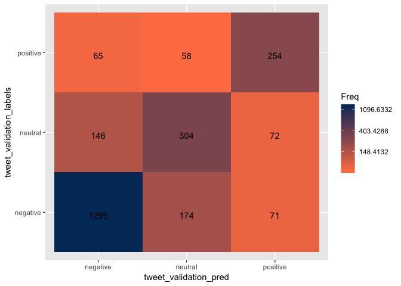

R Notebook
================

Load Library
============

``` r
library(readr)
library(tm)
```

    ## Warning: package 'tm' was built under R version 3.4.3

    ## Loading required package: NLP

``` r
library(SnowballC)
library(wordcloud)
```

    ## Loading required package: RColorBrewer

``` r
library(e1071)
library(gmodels)
library(ggplot2)
```

    ## 
    ## Attaching package: 'ggplot2'

    ## The following object is masked from 'package:NLP':
    ## 
    ##     annotate

``` r
library(caret)
```

    ## Warning: package 'caret' was built under R version 3.4.4

    ## Loading required package: lattice

    ## Warning in as.POSIXlt.POSIXct(Sys.time()): unknown timezone 'zone/tz/2018c.
    ## 1.0/zoneinfo/America/Los_Angeles'

``` r
library(ROCR)
```

    ## Loading required package: gplots

    ## 
    ## Attaching package: 'gplots'

    ## The following object is masked from 'package:wordcloud':
    ## 
    ##     textplot

    ## The following object is masked from 'package:stats':
    ## 
    ##     lowess

Step 1: Load the data
=====================

``` r
tweets <- read_csv("Tweets.csv")
```

    ## Parsed with column specification:
    ## cols(
    ##   tweet_id = col_double(),
    ##   airline_sentiment = col_character(),
    ##   airline_sentiment_confidence = col_double(),
    ##   negativereason = col_character(),
    ##   negativereason_confidence = col_double(),
    ##   airline = col_character(),
    ##   airline_sentiment_gold = col_character(),
    ##   name = col_character(),
    ##   negativereason_gold = col_character(),
    ##   retweet_count = col_integer(),
    ##   text = col_character(),
    ##   tweet_coord = col_character(),
    ##   tweet_created = col_character(),
    ##   tweet_location = col_character(),
    ##   user_timezone = col_character()
    ## )

``` r
head(tweets, n = 10)
```

    ## # A tibble: 10 x 15
    ##           tweet_id airline_sentime… airline_sentiment_conf… negativereason
    ##              <dbl> <chr>                              <dbl> <chr>         
    ##  1         5.70e¹⁷ neutral                            1.00  <NA>          
    ##  2         5.70e¹⁷ positive                           0.349 <NA>          
    ##  3         5.70e¹⁷ neutral                            0.684 <NA>          
    ##  4         5.70e¹⁷ negative                           1.00  Bad Flight    
    ##  5         5.70e¹⁷ negative                           1.00  Can't Tell    
    ##  6         5.70e¹⁷ negative                           1.00  Can't Tell    
    ##  7         5.70e¹⁷ positive                           0.674 <NA>          
    ##  8         5.70e¹⁷ neutral                            0.634 <NA>          
    ##  9         5.70e¹⁷ positive                           0.656 <NA>          
    ## 10         5.70e¹⁷ positive                           1.00  <NA>          
    ## # ... with 11 more variables: negativereason_confidence <dbl>,
    ## #   airline <chr>, airline_sentiment_gold <chr>, name <chr>,
    ## #   negativereason_gold <chr>, retweet_count <int>, text <chr>,
    ## #   tweet_coord <chr>, tweet_created <chr>, tweet_location <chr>,
    ## #   user_timezone <chr>

Step 2: Explore the data
========================

``` r
str(tweets)
```

    ## Classes 'tbl_df', 'tbl' and 'data.frame':    14640 obs. of  15 variables:
    ##  $ tweet_id                    : num  5.7e+17 5.7e+17 5.7e+17 5.7e+17 5.7e+17 ...
    ##  $ airline_sentiment           : chr  "neutral" "positive" "neutral" "negative" ...
    ##  $ airline_sentiment_confidence: num  1 0.349 0.684 1 1 ...
    ##  $ negativereason              : chr  NA NA NA "Bad Flight" ...
    ##  $ negativereason_confidence   : num  NA 0 NA 0.703 1 ...
    ##  $ airline                     : chr  "Virgin America" "Virgin America" "Virgin America" "Virgin America" ...
    ##  $ airline_sentiment_gold      : chr  NA NA NA NA ...
    ##  $ name                        : chr  "cairdin" "jnardino" "yvonnalynn" "jnardino" ...
    ##  $ negativereason_gold         : chr  NA NA NA NA ...
    ##  $ retweet_count               : int  0 0 0 0 0 0 0 0 0 0 ...
    ##  $ text                        : chr  "@VirginAmerica What @dhepburn said." "@VirginAmerica plus you've added commercials to the experience... tacky." "@VirginAmerica I didn't today... Must mean I need to take another trip!" "@VirginAmerica it's really aggressive to blast obnoxious \"entertainment\" in your guests' faces &amp; they hav"| __truncated__ ...
    ##  $ tweet_coord                 : chr  NA NA NA NA ...
    ##  $ tweet_created               : chr  "2015-02-24 11:35:52 -0800" "2015-02-24 11:15:59 -0800" "2015-02-24 11:15:48 -0800" "2015-02-24 11:15:36 -0800" ...
    ##  $ tweet_location              : chr  NA NA "Lets Play" NA ...
    ##  $ user_timezone               : chr  "Eastern Time (US & Canada)" "Pacific Time (US & Canada)" "Central Time (US & Canada)" "Pacific Time (US & Canada)" ...
    ##  - attr(*, "spec")=List of 2
    ##   ..$ cols   :List of 15
    ##   .. ..$ tweet_id                    : list()
    ##   .. .. ..- attr(*, "class")= chr  "collector_double" "collector"
    ##   .. ..$ airline_sentiment           : list()
    ##   .. .. ..- attr(*, "class")= chr  "collector_character" "collector"
    ##   .. ..$ airline_sentiment_confidence: list()
    ##   .. .. ..- attr(*, "class")= chr  "collector_double" "collector"
    ##   .. ..$ negativereason              : list()
    ##   .. .. ..- attr(*, "class")= chr  "collector_character" "collector"
    ##   .. ..$ negativereason_confidence   : list()
    ##   .. .. ..- attr(*, "class")= chr  "collector_double" "collector"
    ##   .. ..$ airline                     : list()
    ##   .. .. ..- attr(*, "class")= chr  "collector_character" "collector"
    ##   .. ..$ airline_sentiment_gold      : list()
    ##   .. .. ..- attr(*, "class")= chr  "collector_character" "collector"
    ##   .. ..$ name                        : list()
    ##   .. .. ..- attr(*, "class")= chr  "collector_character" "collector"
    ##   .. ..$ negativereason_gold         : list()
    ##   .. .. ..- attr(*, "class")= chr  "collector_character" "collector"
    ##   .. ..$ retweet_count               : list()
    ##   .. .. ..- attr(*, "class")= chr  "collector_integer" "collector"
    ##   .. ..$ text                        : list()
    ##   .. .. ..- attr(*, "class")= chr  "collector_character" "collector"
    ##   .. ..$ tweet_coord                 : list()
    ##   .. .. ..- attr(*, "class")= chr  "collector_character" "collector"
    ##   .. ..$ tweet_created               : list()
    ##   .. .. ..- attr(*, "class")= chr  "collector_character" "collector"
    ##   .. ..$ tweet_location              : list()
    ##   .. .. ..- attr(*, "class")= chr  "collector_character" "collector"
    ##   .. ..$ user_timezone               : list()
    ##   .. .. ..- attr(*, "class")= chr  "collector_character" "collector"
    ##   ..$ default: list()
    ##   .. ..- attr(*, "class")= chr  "collector_guess" "collector"
    ##   ..- attr(*, "class")= chr "col_spec"

``` r
tweets <- tweets[, -c(1, 3, 5, 7, 9, 10, 12, 13, 14, 15)]

head(tweets, n = 10)
```

    ## # A tibble: 10 x 5
    ##    airline_sentiment negativereason airline        name       text        
    ##    <chr>             <chr>          <chr>          <chr>      <chr>       
    ##  1 neutral           <NA>           Virgin America cairdin    @VirginAmer…
    ##  2 positive          <NA>           Virgin America jnardino   @VirginAmer…
    ##  3 neutral           <NA>           Virgin America yvonnalynn @VirginAmer…
    ##  4 negative          Bad Flight     Virgin America jnardino   "@VirginAme…
    ##  5 negative          Can't Tell     Virgin America jnardino   @VirginAmer…
    ##  6 negative          Can't Tell     Virgin America jnardino   "@VirginAme…
    ##  7 positive          <NA>           Virgin America cjmcginnis @VirginAmer…
    ##  8 neutral           <NA>           Virgin America pilot      @VirginAmer…
    ##  9 positive          <NA>           Virgin America dhepburn   @virginamer…
    ## 10 positive          <NA>           Virgin America YupitsTate @VirginAmer…

#### Check proportions of negative, neutral, and positive

``` r
#convert to factor before using table
tweets$airline_sentiment <- as.factor(tweets$airline_sentiment)
tweets$airline <- as.factor(tweets$airline)

table(tweets$airline_sentiment)
```

    ## 
    ## negative  neutral positive 
    ##     9178     3099     2363

``` r
table(tweets$airline)
```

    ## 
    ##       American          Delta      Southwest         United     US Airways 
    ##           2759           2222           2420           3822           2913 
    ## Virgin America 
    ##            504

``` r
#Plot proportion table of airlines with their airline sentiment
ggplot(tweets, aes(x = airline, fill = airline_sentiment)) + geom_bar(position = "fill")
```

 \# \#\#\#\#Begin preparing the text data

``` r
#Get rid of special characters
tweets$text <- gsub("[^[:alnum:][:blank:]?&/\\-]", "", tweets$text)

#Looks at tweets 
tweets$text[1:5]
```

    ## [1] "VirginAmerica What dhepburn said"                                                                                        
    ## [2] "VirginAmerica plus youve added commercials to the experience tacky"                                                      
    ## [3] "VirginAmerica I didnt today Must mean I need to take another trip"                                                       
    ## [4] "VirginAmerica its really aggressive to blast obnoxious entertainment in your guests faces &amp they have little recourse"
    ## [5] "VirginAmerica and its a really big bad thing about it"

``` r
#remove @airline name as it is not neccessary
stopwords = c("American", "Delta", "Southwest", "United", "US Airways", "VirginAmerica", "SouthwestAirlines", "AmericanAirlines" )
tweets$text <- removeWords(tweets$text,stopwords)

#check to make sure words were removed 
tweets$text[1:10]
```

    ##  [1] " What dhepburn said"                                                                                                 
    ##  [2] " plus youve added commercials to the experience tacky"                                                               
    ##  [3] " I didnt today Must mean I need to take another trip"                                                                
    ##  [4] " its really aggressive to blast obnoxious entertainment in your guests faces &amp they have little recourse"         
    ##  [5] " and its a really big bad thing about it"                                                                            
    ##  [6] " seriously would pay 30 a flight for seats that didnt have this playingits really the only bad thing about flying VA"
    ##  [7] " yes nearly every time I fly VX this ear worm wont go away "                                                         
    ##  [8] " Really missed a prime opportunity for Men Without Hats parody there https//tco/mWpG7grEZP"                          
    ##  [9] "virginamerica Well I didntbut NOW I DO -D"                                                                           
    ## [10] " it was amazing and arrived an hour early Youre too good to me"

``` r
#create corpus and examine it 
tweet_corpus <- VCorpus(VectorSource(tweets$text))

lapply(tweet_corpus[1:5], as.character)
```

    ## $`1`
    ## [1] " What dhepburn said"
    ## 
    ## $`2`
    ## [1] " plus youve added commercials to the experience tacky"
    ## 
    ## $`3`
    ## [1] " I didnt today Must mean I need to take another trip"
    ## 
    ## $`4`
    ## [1] " its really aggressive to blast obnoxious entertainment in your guests faces &amp they have little recourse"
    ## 
    ## $`5`
    ## [1] " and its a really big bad thing about it"

#### Clean up Corpus

``` r
#Convert text to lowercase 
tweet_corpus_clean <- tm_map(tweet_corpus, content_transformer(tolower))

#remove numbers, stopwords, and punctuation
tweet_corpus_clean <- tm_map(tweet_corpus_clean, removeNumbers)
tweet_corpus_clean <- tm_map(tweet_corpus_clean, removeWords, stopwords('english'))
tweet_corpus_clean <- tm_map(tweet_corpus_clean, removePunctuation)

#Check to see if corpus is clean
lapply(tweet_corpus_clean[1:5], as.character)
```

    ## $`1`
    ## [1] "  dhepburn said"
    ## 
    ## $`2`
    ## [1] " plus youve added commercials   experience tacky"
    ## 
    ## $`3`
    ## [1] "  didnt today must mean  need  take another trip"
    ## 
    ## $`4`
    ## [1] "  really aggressive  blast obnoxious entertainment   guests faces amp   little recourse"
    ## 
    ## $`5`
    ## [1] "    really big bad thing  "

#### Wordstem and check final clean corpus

``` r
#wordstem and strip whitespace 
tweet_corpus_clean <- tm_map(tweet_corpus_clean, stemDocument)
tweet_corpus_clean <- tm_map(tweet_corpus_clean, stripWhitespace)

#remove other common words that dont help with sentiment
stopwords2 <- c("southwestair", "americanair", "jetblu", "usairway", "will", "newark", "houston", "airport",  "airlin", "just", "lax", "can", "ive", "flightl", "jfk", "what", "let", "want", "flightr", "your",  "that", "follow", "one", "flt", "fli", "even", "use", "week", "two", "anoth", "see", "make", "got", "said", "tonight",  "tomorrow", "put", "year", "dfw", "today", "get", "yet", "number", "told", "day", "also", "morn", "min", "someon", "flight", "fleek",  "tweet")

#words that were taken out but could still add sentiment to tweets
#"gate", "plane", "travel", "pilot", "due", "mile",  "made", "unit", "website", "night", "agent", "point", "onlin", "email", "amp", "keep", "miss", "system", "guy", "show", "think", "websit", "fleet"

tweet_corpus_clean <- tm_map(tweet_corpus_clean, removeWords, stopwords2)

#create dataframe
tweet_dtm <- DocumentTermMatrix(tweet_corpus_clean)

#Check final text 
lapply(tweet_corpus_clean[1:5], as.character)
```

    ## $`1`
    ## [1] "dhepburn "
    ## 
    ## $`2`
    ## [1] "plus youv ad commerci experi tacki"
    ## 
    ## $`3`
    ## [1] "didnt  must mean need take  trip"
    ## 
    ## $`4`
    ## [1] "realli aggress blast obnoxi entertain guest face amp littl recours"
    ## 
    ## $`5`
    ## [1] "realli big bad thing"

``` r
tweet_dtm
```

    ## <<DocumentTermMatrix (documents: 14640, terms: 11353)>>
    ## Non-/sparse entries: 108693/166099227
    ## Sparsity           : 100%
    ## Maximal term length: 46
    ## Weighting          : term frequency (tf)

#### Create training and test dataframe and lables

``` r
#create random sample
set.seed(123)
rand_sam <- sample(14640, 13640)

#training and test 
tweet_dtm_train <- tweet_dtm[rand_sam, ]
tweet_dtm_test <- tweet_dtm[-rand_sam, ]

#labels 
tweet_train_labels <- tweets[rand_sam, ]$airline_sentiment
tweet_test_labels <- tweets[-rand_sam, ]$airline_sentiment

#check that proportions are similar
prop.table(table(tweet_train_labels))
```

    ## tweet_train_labels
    ##  negative   neutral  positive 
    ## 0.6269795 0.2111437 0.1618768

``` r
prop.table(table(tweet_test_labels))
```

    ## tweet_test_labels
    ## negative  neutral positive 
    ##    0.626    0.219    0.155

#### Word Cloud visualization

``` r
wordcloud(tweet_corpus_clean,  max.words = 150, min.freq = 5, random.order = F)
```

 \# \#\#\#\#Subset the data to visualize common words for each sentiment

``` r
positive <- subset(tweets, airline_sentiment== "positive")
negative <- subset(tweets, airline_sentiment== "negative")
nuetral <- subset(tweets, airline_sentiment== "neutral")

wordcloud(positive$text, max.words = 100, scale = c(3, .5))
```


``` r
wordcloud(negative$text, max.words = 100, scale = c(3, .5))
```


``` r
wordcloud(nuetral$text, max.words = 100, scale = c(3, .5))
```

 \# \# \#Step 3: Training a model on the data

``` r
tweet_dtm_freq_train <- removeSparseTerms(tweet_dtm_train, 0.999)
tweet_dtm_freq_train
```

    ## <<DocumentTermMatrix (documents: 13640, terms: 1054)>>
    ## Non-/sparse entries: 81398/14295162
    ## Sparsity           : 99%
    ## Maximal term length: 17
    ## Weighting          : term frequency (tf)

``` r
tweet_freq_words <- findFreqTerms(tweet_dtm_train, 5)
str(tweet_freq_words)
```

    ##  chr [1:2060] "aadvantag" "abc" "abil" "abl" "abq" "absolut" "absurd" ...

#### Create DTMs with only the frequent terms

``` r
tweet_dtm_freq_train <- tweet_dtm_train[ , tweet_freq_words]
tweet_dtm_freq_test <- tweet_dtm_test[ , tweet_freq_words]
```

#### Create a function to convert counts to a factor and apply it to columns of train/test data and begin training a model on the data

``` r
convert_counts <- function(x) {
  x <- ifelse(x > 0, "Yes", "No")
}

tweet_train <- apply(tweet_dtm_freq_train, MARGIN = 2, convert_counts)
tweet_test <- apply(tweet_dtm_freq_test, MARGIN = 2, convert_counts)

tweet_classifier <- naiveBayes(tweet_train, tweet_train_labels)
```

#### Evaluate the model's performance

``` r
tweet_test_pred <- predict(tweet_classifier, tweet_test)

head(tweet_test_pred, n = 15)
```

    ##  [1] neutral  positive negative positive positive negative negative
    ##  [8] negative positive negative neutral  neutral  negative negative
    ## [15] neutral 
    ## Levels: negative neutral positive

``` r
conf<- confusionMatrix(tweet_test_pred, tweet_test_labels)
conf
```

    ## Confusion Matrix and Statistics
    ## 
    ##           Reference
    ## Prediction negative neutral positive
    ##   negative      518      60       26
    ##   neutral        78     132       25
    ##   positive       30      27      104
    ## 
    ## Overall Statistics
    ##                                           
    ##                Accuracy : 0.754           
    ##                  95% CI : (0.7261, 0.7804)
    ##     No Information Rate : 0.626           
    ##     P-Value [Acc > NIR] : <2e-16          
    ##                                           
    ##                   Kappa : 0.549           
    ##  Mcnemar's Test P-Value : 0.4385          
    ## 
    ## Statistics by Class:
    ## 
    ##                      Class: negative Class: neutral Class: positive
    ## Sensitivity                   0.8275         0.6027          0.6710
    ## Specificity                   0.7701         0.8681          0.9325
    ## Pos Pred Value                0.8576         0.5617          0.6460
    ## Neg Pred Value                0.7273         0.8863          0.9392
    ## Prevalence                    0.6260         0.2190          0.1550
    ## Detection Rate                0.5180         0.1320          0.1040
    ## Detection Prevalence          0.6040         0.2350          0.1610
    ## Balanced Accuracy             0.7988         0.7354          0.8018

``` r
confusion_matrix <- as.data.frame(table(tweet_test_pred, tweet_test_labels))

ggplot(data = confusion_matrix,      aes(x = tweet_test_pred, y = tweet_test_labels)) +
  geom_tile(aes(fill = Freq)) +
  geom_text(aes(label = sprintf("%1.0f", Freq)), vjust = 1) +
  scale_fill_gradient(low = "#ff7f50",
                      high = "#003767",
                      trans = "log")
```

 \#\#\#\#75.5% classified accurately \# \#Step 5: Improve the model

``` r
tweet_classifier2 <- naiveBayes(tweet_train, tweet_train_labels, laplace = 1)
tweet_test_pred2 <- predict(tweet_classifier2, tweet_test)

conf2<- confusionMatrix(tweet_test_pred2, tweet_test_labels)
conf2
```

    ## Confusion Matrix and Statistics
    ## 
    ##           Reference
    ## Prediction negative neutral positive
    ##   negative      543      67       27
    ##   neutral        66     132       26
    ##   positive       17      20      102
    ## 
    ## Overall Statistics
    ##                                           
    ##                Accuracy : 0.777           
    ##                  95% CI : (0.7499, 0.8025)
    ##     No Information Rate : 0.626           
    ##     P-Value [Acc > NIR] : <2e-16          
    ##                                           
    ##                   Kappa : 0.5798          
    ##  Mcnemar's Test P-Value : 0.382           
    ## 
    ## Statistics by Class:
    ## 
    ##                      Class: negative Class: neutral Class: positive
    ## Sensitivity                   0.8674         0.6027          0.6581
    ## Specificity                   0.7487         0.8822          0.9562
    ## Pos Pred Value                0.8524         0.5893          0.7338
    ## Neg Pred Value                0.7713         0.8879          0.9384
    ## Prevalence                    0.6260         0.2190          0.1550
    ## Detection Rate                0.5430         0.1320          0.1020
    ## Detection Prevalence          0.6370         0.2240          0.1390
    ## Balanced Accuracy             0.8080         0.7425          0.8071

``` r
confusion_matrix <- as.data.frame(table(tweet_test_pred2, tweet_test_labels))

ggplot(data = confusion_matrix,      aes(x = tweet_test_pred2, y = tweet_test_labels)) +
  geom_tile(aes(fill = Freq)) +
  geom_text(aes(label = sprintf("%1.0f", Freq)), vjust = 1) +
  scale_fill_gradient(low = "#ff7f50",
                      high = "#003767",
                      trans = "log")
```

 \#\#\#\#77.2% classified accurately
